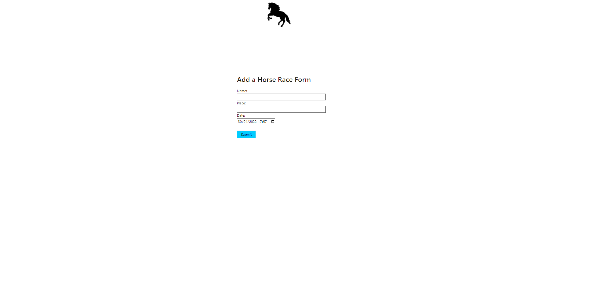

# Project Name: HorseRacing
### Author: Hans-Märten Liiu
 

Main Idea:
-------------

* Users are able to create a race (place and time)
* Users are able to enter horses participating in (name color)
* All horses entered are also stored in the database
* You can bet only on one horse
* Horse race: system computes race results with a random function.
* The system shows the user race results: the user wins upon picking the winner horse and loses in all other circumstances.
* All race results will be saved to the database
* All race results can be browsed in the UI
* At least some of the application is covered by tests
* Application is deployed (to heroku, aws etc)

## Application deployment details:
* PS on first launch definately open both heroku webpages for the application to boot up. Application usually takes a bit of time to boot, sometimes you might even see some errors then just refresh the page until it boots up, this happens because it is hosted on free account.
* Backend deployed at heroku: https://backend-horseracing.herokuapp.com/
* Backend heroku sends data to MongoDB Atlas
* Frontend deployed at heroku: https://frontend-horseracing.herokuapp.com/

 

## Application functional details:
* You can see horserace listings
* You filter races by status
* You sort races by date(ascending, descending)
* You can add a race
* You can add horses to a race
* You can see race's detailed view
* You can bet on race
* You can generate race Winner, when time is past race start time.
* You can see if you won or not on race's detailedview
* If you would like to see some old race result then on main page you can sort for ended races and find one you like and then open race details and there is shown who won.

 

## What can be done next:
* Maybe make a currency system, so users can actually win or lose currency
* Add amount how much you would like to bet
* Maybe move the Add a Horse to the race to some different spot on the page or even to another page.
* Flexible design
* User profiles

 

## How to boot the application(no reason to do that, because the application is deployed):
* Open up cmd and cd into backend-node folder and then npm start
* Open up another CMD and cd into horserace-front-end folder and then npm install. After packages are installed you can npm start and the application will pop up.

 

## Tests
* For the Backend test you need to open up cmd and cd into backend-node folder. Inside backend folder you can type npm test and it will do the rest automatically.
* For the frontend test to run you need to go to the App.js file and delete the Navbar component and then the test will run perfectly fine. We must remove it for the test to run, because the navbar compnent uses usecontext and npm test doesn't like that. Also we don't need to test navbar, because there isn't anything important for the application to work. If the Navbar is removed then open up CMD and cd into horserace-front-end folder and then npm test and it will do the rest automatically.

 

## Images of the application
* HomePage

* Main page

* EventView

* Login Form

* Register

* AddRace Form

 

